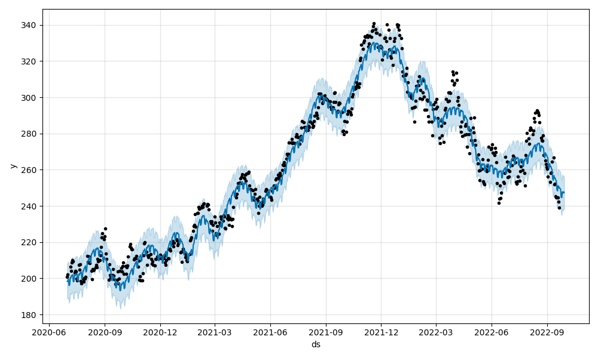
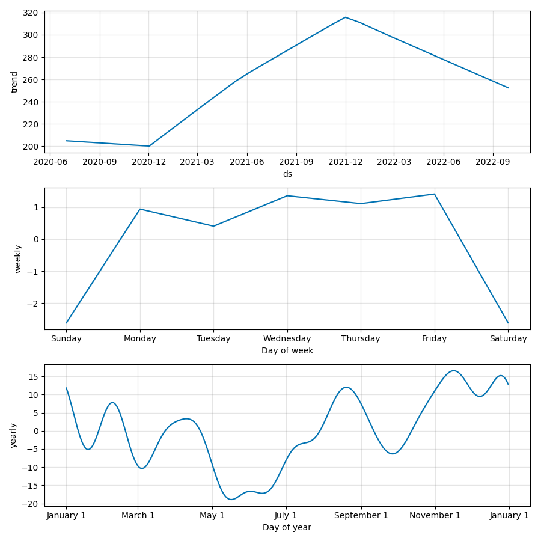

# Goal of this project

- Develop a RESTful API with FastAPI
- Build a basic time series model to predict stock prices
- Deploy a FastAPI to AWS EC2
- Predict Nasdaq top 100 company, update model with CI.
=======
## Run FASTAPI on local:
uvicorn main:app --reload --workers 1 --host 0.0.0.0 --port 8000

## Steps:
1. Create a vir. env. with requirements.
2. pretrain the model by running python model.py
3. Run main.py with uvicorn
uvicorn main:app --reload --workers 1 --host 0.0.0.0 --port 8000
4. Do the prediction.

## Stock prediction and deployment on AWS
# run the app with public access
http://184.72.85.136:8000/docs


# Stock Prophet 
In this project, we will be **deploying** a stock prediction model as a RESTful API using [FastAPI](https://fastapi.tiangolo.com/) to AWS EC2, and make it available (i.e., public) to end users. Less focus is put on how well the model performs, yet the goal is to get an initial working system quickly into production:
    
    data -> model -> API -> deployment

# Step 1. Project Setup
1. Create a new repository `stock-predictor` on GitHub; make sure to include:
    - `README.md`, with a title and short description of the project
    - .gitignore using `Python` template
    - MIT license
1. Create a new virtual environment for this project:
    
    `conda create -n stock-predictor python=3.8`
1. Install the following dependencies:

    `pip install -U -q fastapi uvicorn` 

1. Clone the repo to your local machine 
1. Activate the virtual environment to start the development process
    
    `conda activate stock-predictor`
4. Create a file `main.py` for our app. Inside the file, create a new instance of `FastAPI` and set up a quick test route

    ```python
    from fastapi import FastAPI
    app = FastAPI()

    @app.get("/ping")
    def pong():
        return {"ping": "pong!"}
    ```
5. Launch the app in the shell and test the route using the command:
    
    `uvicorn main:app --reload --workers 1 --host 0.0.0.0 --port 8000`

    Below is the explanation of the command:
    - `--reload` enables auto-reload so the server will restart after changes are made to the code base.
    - `--workers 1` provides a single worker process.
    - `--host 0.0.0.0` defines the address to host the server on.
    - `--port 8000` defines the port to host the server on.
    - `main:app` tells `uvicorn` where it can find the `FastAPI` ASGI application. In this case, within the `main.py` file, you will find the ASGI app `app = FastAPI()`.

1. Navigate to http://localhost:8000/ping in your browser. You should see:

    ```json
    {
        "ping": "pong!"
    }
    ```

# Step 2. Time series model

We will use [Prophet](https://facebook.github.io/prophet/) to predict stock market prices. 

1. Install the dependencies:
    - Basic data manipulation and plotting: `pandas matplotlib`
    - Data and modeling: `yfinance pystan prophet joblib`

2. Create a new file `model.py` and add the following code to train the model and generate a prediction:


    1. Here we defined three functions (this model was developed by [Andrew Clark](https://twitter.com/aclarkdata1)):

    2. `train` downloads historical stock data with [`yfinance`](https://github.com/ranaroussi/yfinance), creates a new Prophet model, fits the model to the stock data, and then serializes and saves the model as a [`Joblib file`](https://joblib.readthedocs.io/en/latest/generated/joblib.dump.html).

    3. `predict` loads and deserializes the saved model, generates a new forecast, creates images of the forecast plot and forecast components, and returns the days included in the forecast as a list of dicts.

    4. `convert` takes the list of dicts from `predict` and outputs a dict of dates and forecasted values; e.g., `{"07/02/2020": 200}`).

3. Let's run it and see the results. In a shell, run:
    
    `python model.py`

    Output shall looks similar to the following (the output was generated in the late afternoon on July 19, 2022)

    ```
    [*********************100%***********************]  1 of 1 completed
    15:30:36 - cmdstanpy - INFO - Chain [1] start processing
    15:30:36 - cmdstanpy - INFO - Chain [1] done processing
    {'07/20/2022': 254.67755986604763, '07/21/2022': 254.3739109884936, '07/22/2022': 254.0702621109396, '07/23/2022': 253.7666132333857, '07/24/2022': 253.46296435583167, '07/25/2022': 253.15931547827768, '07/26/2022': 252.8556666007237}
    15:30:38 - cmdstanpy - INFO - deleting tmpfiles dir: /var/folders/dk/5zskzghd2wl17_jf1yl86hh80000gn/T/tmpzwrmagib
    15:30:38 - cmdstanpy - INFO - done
    ```

    ```
    {
        '07/20/2022': 254.67755986604763, 
        '07/21/2022': 254.3739109884936, 
        '07/22/2022': 254.0702621109396, 
        '07/23/2022': 253.7666132333857, 
        '07/24/2022': 253.46296435583167, 
        '07/25/2022': 253.15931547827768, 
        '07/26/2022': 252.8556666007237
    }
    ```
    are the predicted prices for the next 7 days for the Microsoft stock (ticker: MSFT).

    Take note that the saved `MSFT.joblib` model along with two images
    <p align="center">
    
    
    </p>

5. Push changes to repo once it is satified your criteria.

## Step 3. Routes

*  Add a `/predict` endpoint by updating `main.py`, create pydantic models:
    ```python
    from fastapi import FastAPI, Query, HTTPException
    from pydantic import BaseModel
    from model import predict, convert

    app = FastAPI()
 
    ```

    So, in the new function `get_prediction`, we passed in a ticker to our model's `predict` and then used `convert` to create the output for the response object. We also took advantage of a `pydantic` [schema](https://pydantic-docs.helpmanual.io/usage/schema/) to covert the JSON payload to a `StockIn` object schema. This provides automatic type validation. The response object uses the `StockOut` schema object to convert the Python `dict` - `{"ticker": ticker, "days": days, "forecast": convert(prediction_list)}` - to JSON, which, again, is validated.

* Run the app locally.

    ```uvicorn main:app --reload --workers 1 --host 0.0.0.0 --port 8000```

* Test the endpoint. Open a new shell, use `curl` to test the endpoint:
    ```
    curl \
    --header "Content-Type: application/json" \
    --request POST \
    --data '{"ticker":"MSFT", "days":7}' \
    http://0.0.0.0:8000/predict
    ```

    You shall see something like:
    ```python
    {
        "ticker":"MSFT",
        "days":7,
        "forecast":{
            "07/20/2022":254.67755986604763,
            "07/21/2022":254.3739109884936,
            "07/22/2022":254.0702621109396,
            "07/23/2022":253.7666132333857,
            "07/24/2022":253.46296435583167,
            "07/25/2022":253.15931547827768,
            "07/26/2022":252.8556666007237
        }
    }
    ```

* Navigate to `http://127.0.0.1:8000/docs` (or `http://localhost:8000/docs`) and see the interactive API documentation (you can take a sneak peek [here](http://35.90.247.255:8000/docs)).

* Generate requirements file for your working app in a shell:
    ```
    pip list --format=freeze > requirements.txt
    ```
## Step 4. AWS Deployment
1. Create your EC2 instance in the AWS management tool. The UI is straightforward and for most settings, use the default. Refer to the [tutorial](https://docs.aws.amazon.com/AWSEC2/latest/UserGuide/EC2_GetStarted.html#ec2-launch-instance) for more information. Note:

    - Use `stock-predictor-fastapi` for the **Key pair name** when generating the `pem` file.

    - In Step 1-7 **Network Setting**: click `Edit` and make sure you have two (or three) security group rules. One has the type SSH with port 22, and another TCP port for the API, e.g., `8000`, edit the source. See the bottom of the screenshot below for reference. 
        <p align="center">
        
        </p>

2. Once you launch the instance, it should take ~30 seconds to start. Click into your instance. Refresh to see the `Connect` button is no longer grayed out, and click `Connect`. 

3. In the `Connect to instance` tab, find `SSH client`. Move the `stock-predicr-fastapi.pem` file you downloaded earlier to your local repo. Follow the instruction, change the permissions:
    ```
    chmod 400 stock-predictor-fastapi.pem
    ```
4. Update file `.gitignore` to include the `pem` file, and push all your working code to the repository. **NEVER** push your secret keys to the repository.

5. Access the EC2 Instance using ssh. In the same `Connect to instance` tab, you can find the command to access the instance via ssh, something like:

    `ssh -i "stock-predictor-fastapi.pem" ec2-user@ec2-35-90-247-255.us-west-2.compute.amazonaws.com`
 * for ubuntu use "ubuntu" instead of ec2-user
    Run the command where `stock-predictor-fastapi.pem` is located.  
6. If you see something similar to the following, then congratulations! you are in the right place:
    ```
    flora@MacBook-Air stock-predictor % ssh -i "stock-predictor-fastapi.pem" ec2-user@ec2-35-90-247-255.us-west-2.compute.amazonaws.com
    Last login: Tue Jul 19 21:58:43 2022 from 47.157.165.203

        __|  __|_  )
        _|  (     /   Amazon Linux 2 AMI
        ___|\___|___|

    https://aws.amazon.com/amazon-linux-2/
    [ec2-user@ip-172-31-24-66 ~]$ 
    ```

7. Set up environment
    ```
    sudo yum update -y 
    sudo yum install git -y  # install git

    # install tmux to switch easily between programs in one terminal
    sudo yum install tmux

    # install miniconda and add its path to env
    wget https://repo.continuum.io/miniconda/Miniconda3-latest-Linux-x86_64.sh -O ~/miniconda.sh
    bash ~/miniconda.sh -b -p ~/miniconda
    echo "PATH=$PATH:$HOME/miniconda/bin" >> ~/.bashrc
    source ~/.bashrc
    ```
8. Clone the repository (use https for convenience) and install all dependencies
    ```
    git clone https://github.com/[YOUR HANDLER]/stock-predictor.git
    cd stock-predictor
    pip install -U pip
    pip install -r requirements.txt
    ```
9. Before launching the app, we can avoid ssh time out using `tmux` to create a new session. 
    ```
    tmux new -s stock_session
    ```
    If you skip this step, the app will be closed after you exit the ssh session.
10. Navigate to the same directory where `main.py` is (e.g., repo root directory or `src`) and run the app

    ```
    uvicorn main:app --reload --workers 1 --host 0.0.0.0 --port 8000
    ```

    The shell looks like this:
    ```
    [ec2-user@ip-172-31-24-66 src]$ uvicorn main:app --reload --workers 1 --host 0.0.0.0 --port 8000                                                  
    INFO:     Will watch for changes in these directories: ['/home/ec2-user/stock-predictor/src']
    INFO:     Uvicorn running on http://0.0.0.0:8000 (Press CTRL+C to quit)
    INFO:     Started reloader process [9693] using StatReload
    INFO:     Started server process [9695]
    INFO:     Waiting for application startup.
    INFO:     Application startup complete.
    ```
    
11. Now find the Public IPv4 address for your instance, e.g., 35.90.247.255, and run the following in another shell on your local machine:

    ```
    curl \
    --header "Content-Type: application/json" \
    --request POST \
    --data '{"ticker":"MSFT", "days":7}' \
    http://52.11.114.229:8000/predict
    ```

    You shall see the predictions 🎉🎉🎉

    Don't forget to include this command to the README.md file.

12. Final step: detach `tmux` session so that it continues running in the background when you leave ssh shell. Press `Ctrl`+`b`, release, then press `d` (NOT `Ctrl`, `b`, and `d` together). Then you can leave the ssh shell and the app will continue running.

    You can attach the session by running `tmux attach -t stock_session`.

13. You shall be able to access the API documentation and share it with others. Use the Public IP address for your EC2 instance, e.g., `http://52.11.114.229:8000/docs`. 

    <details>
    <summary> Screenshots of the docs.
    </summary>

    Click `Try it out` to make predictions interactively.

    <p align="center">
    
    
    </p>
    </details>

# Model understanding
1. How does the Prophet Algorithm differ from an LSTM? Why does an LSTM have poor performance against ARIMA and Prophet for Time Series?
The Prophet algorithm is different from an LSTM because an LSTM is based on neural networks, while Prophet is a formula containing only four terms: for the trend, seasonality, holidays, and errors. LSTM can have poor performance against ARIMA and Prophet for time series forecasting (e.g., stock prediction) because it is prone to overfitting. This is especially true for small datasets, and the issue cannot easily be solved dropout or other forms of regularization. LSTM is better suited to very large datasets where we want to uncover complex patterns.

2. What is exponential smoothing and why is it used in Time Series Forecasting?
Exponential smoothing is an averaging technique to reduce the variation of (smooth) time series data. The technique is called exponential smoothing because the weights of the current and previous data points in the average are calculated based on an exponential function (1 - weight)^n. It is used in Time Series Forecasting to get the general trend from noisy data by removing (smoothing out) the noise.

3. What is stationarity? What is seasonality? Why Is Stationarity Important in Time Series Forecasting?
Stationarity is when a time series is not affected by the time of the measurement. In contrast, seasonality is when a time series is affected by the time of the measurement. An simple example of seasonality is the average monthly temperature of a town. This measurement has a yearly seasonality, since (for the northern hemisphere) temperatures are warmer in the summer and colder in the winter. When a time series has seasonality, the measurement will be affected by trends and seasons. These are important concepts in time series forecasting because it is useful to break out each component that contributes to the time series so that they can be analyzed and predicted separately. If a model understands and can predict these components, then future predictions will be more accurate.

4. How is seasonality different from cyclicality? Fill in the blanks: ___ is predictable, whereas ___ is not.
Seasonality is observed over the calendar year, while cyclicality are effects that may last longer (or shorter) and could be related to other effects that come and go (i.e., have cycles). Seasonality is predictable, whereas cyclicality is not.

# Understanding of Docker
1. What does it mean to create a Docker image and why do we use Docker images?

A Docker image is a file used to execute code in a Docker container. Docker images act as a set of instructions to build a Docker container, like a template. An image is comparable to a snapshot in virtual machine environments.

2. Please explain what is the difference from a Container vs a Virtual Machine?

Virtual Machine is virtualize an entire machine down to the hardware layers. Containers only virtualize software layers above the operating system level.

3. What are 5 examples of container orchestration tools (please list tools)?

Container orchestration is the automation of much of operational effort required to run containerized workloads and services. Examples are:

Kubernetes, Openshift, Hasicorp Nomad, Docker Swam, Rancher, Mesos

4. How does a Docker image differ from a Docker container?

Docker image is a template that defines how a container will be realized.

Docker cotainer is a runtime instance of a Docker image.

# 
